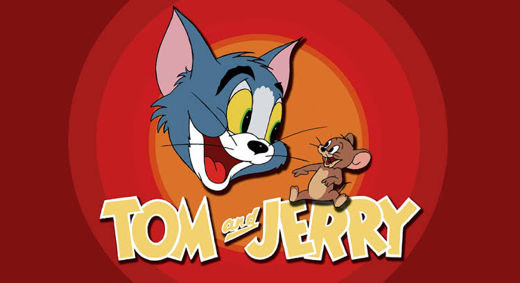

<!Desenho html>
<html lang="pt-br">
<head>
    <meta charset="UTF-8">
    <meta name="viewport" content="width=device-width, initial-scale=1.0">
    <title>Document</title>
</head>
<body>
    <!DOCTYPE html>
<html>
<head>
  <title>Titulo da pagina</title>
</head>
<body>
  <h1>desenho</h1>
  
Tom é um gato determinado, porém impaciente, cujo objetivo de vida é capturar o ratinho Jerry. Porém, o pequeno animal é inteligente e cheio de habilidades. O clássico desenho acompanha as loucas e eletrizantes perseguições entre gato e rato.

</body>
</html>
    
    
<!DOCTYPE html>
<html lang="pt-br">
<head>
    <meta charset="UTF-8">
    <meta name="viewport" content="width=device-width, initial-scale=1.0">
    <title>Document</title>
</head>
<body>
    
